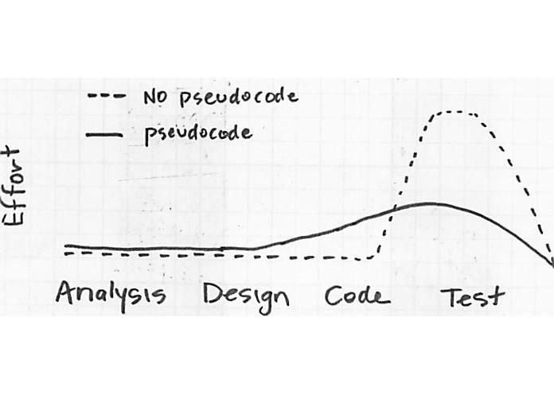

# 의사코드란?

- 프로그램 코드를 작성할 때 사용하기 위해, 컴퓨터 프로그램이나 알고리즘이 수행해야 할 내용을 우리가 사용하는 언어(한국어 또는 영어 등)로 단계별로 간략히 서술해 놓은 것
  - 사고를 명확히 정립하게 만들어 프로그램을 설계하는데 도움이 된다. (디버그 및 코드 재분해 시간을 단축)



- 의사코드를 작성했을때와 아닐때의 차이

<br>

## 의사코드 작성의 장점

1. 코드 리뷰가 더 쉬워진다.

   - 의사코드로 소스코드의 실행 없이 상세 설계를 검토할 수 있다.
   - 하위 설계 단계의 프로그램을 쉽게 검토할 수 있어 작성된 프로그램의 검토 시간을 줄일 수 있다.
   - 지속적인 프로그램 개선에 큰 도움이 된다.
     - 상위 단계의 프로그램의 오류는 상위 단계에서, 중간 단계의 오류는 중간 단계에서, 하위 단계의 오류는 하위 단계에서 검토할 수 있게 된다.

2. 코드 수정을 좀 더 용이하게 만들어 준다.

   - 코드를 수정하는 것 보다 일부 의사코드 몇 줄을 수정하는 것이 쉽다.
   - 성공적인 프로젝트를 만들기 위해서는 최소한의 노력으로 고칠 수 있는 단계(least-value stage)에서 오류를 바로 잡는 것이 매우 중요하다.
     - 코드입력, 테스트, 디버그 수정 단계에서 작업하는 것보다 의사코드 설계 단계에서 미리 오류를 수정하는 것이 훨씬 경제적이기 때문

3. 주석 작성에 대한 부담을 덜어준다.
   - 의사코드는 다른 프로그래밍 설계 문서보다 유지 보수가 쉽다.
   - 의사코드는 코드 안에 작성되기 때문에 코멘트가 계속 추가되면서 의사코드 설계 작성이 정교해진다.

<br />

## 의사코드를 효과적으로 작성하는 방법

1. 의사코드와 코드 모두 같은 스타일로 일관성있게 작성한다.
   - 똑같은 연산 기호를 사용하며, 적절한 곳에, 이해될 수 있는 문장으로 작성한다.
2. 불필요한 내용은 무시한다.
3. 확실한 내용을 여러번 말하지 않는다.
   - 값의 유형을 정하는 것이 중요한 문제가 아니라면, 정확하게 값을 구분하는 것이 필요없을 수도 있다.
4. 프로그래밍에 쓰이는 문법을 이용해 작성한다.
   - if/else, while은 영어 단어와 같기 때문에, 이를 사용하여 의사코드를 좀 더 명확하게 작성할 수 있다.
   - 적은 수의 단어를 조합하여 의사코드를 작성하는 것도 좋은 방법이다.
   - 변수 사용은 의사코드를 간단명료하게 만들어주기 때문에 생략하지 말아야 한다.
5. 사용할 목적과 상황에 주의하여 작성한다.
   - 빠른 정렬(quick sort) 알고리즘을 쓰고자 할 때, 단순히 quick sort 라고 의사코드를 작성하게 되면 상세한 내용을 생략하게 된 것이다. 이런 경우 의사코드로 알고리즘 전체를 한번에 꿰뚫어볼 수 없다면 알고리즘을 쉽게 분석하기 어려워진다.
6. 수준을 고려해 작성한다.
   - 다른 사람이 본인이 작성한 의사코드가 이해하기 너무 어려워 실제 코드로 옮기기 어렵다면 선택한 난이도에 문제가 있다는 뜻이다.

<br>

## 의사코드에서 많이 쓰이는 영어 단어

- 입력(input) : READ, OBTAIN, GET

- 출력(output) : PRINT, DISPLAY, SHOW

- 계산(Compute) : COMPUTE, CALCULATE, DETERMINE

- 초기화(Initialize) : SET, INIT

- 요소를 추가(Add one) : INCREMENT, BUMP

- 선형적으로 증가할 때(Linear progression) : SEQUENCE

- 반복 : WHILE, FOR

- 조건문 : IF-THEN-ELSE

- 마지막에 조건문이 있는 반복문 : REPEAT-UNTIL

- IF-THEN-ELSE 대신 조건 분기처리 : CASE

- 부울 : TRUE / FALSE

- 그외 : REPEAT - UNTIL RETURN BEGIN / EXCEPTION / END

<br>

## 의사코드를 실제로 작성해보자

- 판매세가 포함된 물건 값을 계산하는 프로그램을 작성할때, 각 단계별로 해야할 일을 의사코드로 옮기면 아래와 같다.

  1. get price of item <br>// 물건 값 투입하기
  2. get sales tax rate <br>// 세금 할인율 투입하기
  3. sales tax = price of item times sales tax rate <br>// 판매세 = 물건값 \* 세금율
  4. final price = price of item plus sales tax <br>// 총합 = 총합 + 판매세
  5. display final price <br>// 총합 표시하기
  6. halt <br>// 종료

- 간단한 수식은 연산기호와 숫자를 사용하여 쓰는 것이 좋다.
- 의사코드에 쓰인 변수명 리스트를 price of item, sales tax rate, sales tax, final price 와 같이 따로 정리할 수 있다.

```js
const readline = require("readline");

const rl = readline.createInterface({
  input: process.stdin,
  output: process.stdout,
});

function computeSalesTax() {
  // 1. getprice of item (물건 값 투입하기)
  rl.question("What is the item's price?", price => {
    console.log(`The price of itme is ${price}.`);

    // 2. get sales tax rate (세금 할인율 투입하기)
    rl.question("Enter the sales tax rate. in decimal: ", taxRate => {
      // 3. sales tax = price of item times sales tax rate
      //    (판매세 = 물건값 * 세금율)
      const tax = price * taxRate;

      // 4. final price = price of itme plus sales tax
      //    (총합 = 총합 + 판매세)
      const final = parseInt(price) + tax;

      // 5. display final price (총합 표시하기)
      console.log(`The final price is ${final}.`);

      // 6. halt (종료)
      rl.clsoe();
    });
  });
}
```

---

링크 <br>
[좋은 의사코드 작성법](https://sujinlee.me/pseudocode/)
